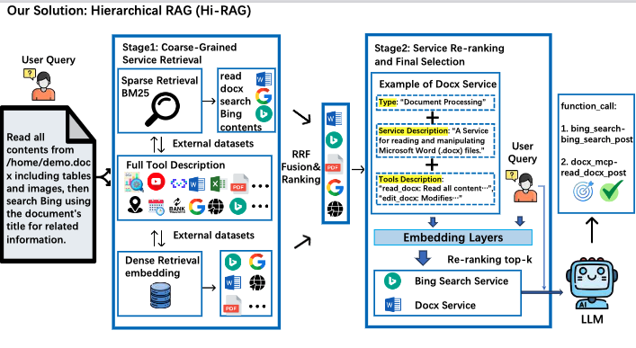

# HiRAG

<div align="center">
  
</div>

---

## 📝 Introduction

**HiRAG** (Hierarchical Retrieval-Augmented Generation) 是一种层次化的多服务检索增强生成框架，旨在提升大语言模型在复杂任务中的工具选择和调用能力。  
本项目包含完整的环境搭建流程、多种语言模型的部署方式以及对比实验的执行脚本，适用于单服务和多服务任务场景。

---

## 🔧 Environment Setup

### 1. 安装 Conda

请参考官方文档：[Miniconda Installation](https://docs.conda.io/en/latest/miniconda.html)

### 2. 创建并激活环境

```bash
conda create -n hi_rag -y python=3.12
conda activate hi_rag
pip install -r requirements.txt
```

---

## 🚀 启动大语言模型（LLM）

使用 [vLLM](https://github.com/vllm-project/vllm) 启动不同的模型服务：

```bash
# Qwen3-32B
nohup vllm serve Qwen3-32B \
    --port 38084 \
    --gpu-memory-utilization 0.9 \
    --max-model-len 32768 \
    --seed 0 > qwen3_32b.log 2>&1 &

# QwQ-32B
nohup vllm serve QwQ-32B \
    --port 38080 \
    --gpu-memory-utilization 0.9 \
    --max-model-len 32768 \
    --seed 0 > qwq.log 2>&1 &

# Qwen3-8B
nohup vllm serve Qwen3_8B \
    --gpu-memory-utilization 0.9 \
    --tensor-parallel-size 2 \
    --max-model-len 32768 \
    --seed 0 > qwen3_8b.log 2>&1 &
```

---

## 🧪 Experiments

本项目提供三种不同设置的实验运行脚本，覆盖 Flat-RAG、Full Service 和 HiRAG 方法。

### 1. Full Service 设置

| 场景 | 命令 |
|------|------|
| 单服务（sig） | `python run_sig.py` |
| 多服务（mul） | `python run_mul.py` |

---

### 2. Flat RAG Baseline

| 场景 | 命令 |
|------|------|
| 单服务（sig） | `python run_sig_rag_top1.py` |
| 多服务（mul） | `python run_mul_rag_top3.py` |

---

### 3. HiRAG（本项目核心方法）

| 场景 | 命令 |
|------|------|
| 单服务（sig） | `python run_sig_Hi_rag_top1.py` |
| 多服务（mul） | `python run_mul_Hi_rag_top3.py` |

---


