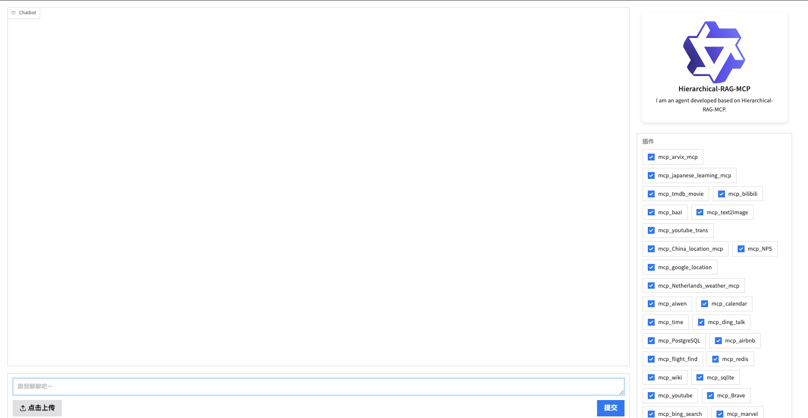

# Hi-RAG: Structure-Aware Tool Selection

<div align="center">


<em>Official implementation of "Beyond Flat Retrieval: Structure-Aware Tool Selection with Hi-RAG"</em>
</div>

<div align="center">

</div>

---

## 📖 Introduction

**Hi-RAG** (Hierarchical Retrieval-Augmented Generation) is a novel framework designed to operationalize structure awareness in Large Language Model (LLM) agents. By explicitly leveraging the hierarchical nature of tool protocols (e.g., Model Context Protocol), Hi-RAG creates a high-fidelity, low-noise context for efficient and accurate tool selection.

### Key Features

- **Structure-Aware Retrieval**: Leverages hierarchical tool organization (Type → Service → Tool) for more precise retrieval
- **Multi-Stage Architecture**: Combines coarse-grained and fine-grained retrieval with reranking
- **Comprehensive Benchmarks**: Evaluated on both HiMCPBench (MCP-based) and ToolBench (REST API-based)
- **High Performance**: Achieves superior NDCG scores across single-service and multi-service scenarios

### Repository Contents

1. **Hi-RAG Framework**: Source code for structure-aware retrieval and reasoning pipeline
2. **HiMCPBench**: Large-scale benchmark featuring **201 tools** across **40 services**
3. **ToolBench Integration**: Evaluation scripts for the ToolBench dataset

---

## ⚙️ Environment Setup

### 1. Installation

We recommend using Conda to manage the environment.

```bash
# Create and activate environment
conda create -n rag_py312 -y python=3.12
conda activate rag_py312

# Install dependencies
pip install -r requirements.txt
```

### 2. LLM Backend Serving (vLLM)

Hi-RAG requires an LLM backend for inference and embedding models for retrieval. We utilize [vLLM](https://github.com/vllm-project/vllm) for high-performance serving.

> **Note:** Please verify your GPU memory availability. Adjust `--gpu-memory-utilization` as needed.

```bash
# 1. Start the Generator LLM (e.g., Qwen3-32B)
# Port: 38084
nohup vllm serve Qwen3-32B \
    --port 38084 \
    --gpu-memory-utilization 0.9 \
    --max-model-len 32768 \
    --seed 0 > qwen3_32b.log 2>&1 &

# 2. Start the Embedding Model (BGE-Large)
# Port: 8083
vllm serve BAAI/bge-large-en-v1.5 --task embed --port 8083

# 3. Start the Reranker Model (BGE-Reranker)
# Port: 8085
vllm serve BAAI/bge-reranker-base --task score --port 8085
```

---

## 🗂️ Datasets & Benchmarks

### HiMCPBench (MCP-Based Evaluation)

Our benchmark, **HiMCPBench**, is meticulously constructed from real-world **Model Context Protocol (MCP)** specifications.

#### Data Organization

- **Service Schemas** (`app/mcp_service/`): Contains definitions for **8 Categories**, **40 Services**, and **201 Tools**
- **Evaluation Queries** (`data/query_test/`):
  - `sig_mcp_test.json`: **Single-Service** queries (Precision focus)
  - `mul_mcp_test.json`: **Multi-Service** queries (Complex reasoning focus)

#### High-Fidelity Service Stubs

To ensure **scientific reproducibility** and **deterministic evaluation**, the services in this repository are implemented as **High-Fidelity Service Stubs**.

- **Semantic Layer:** We strictly preserve the *original* Pydantic models, function signatures, and semantic docstrings from real-world MCP registries (e.g., YouTube, GitHub, Slack) to maintain the full complexity of the reasoning task.
- **Execution Layer:** The backend execution logic is decoupled and simulated. This isolates the model's **tool selection capability** from external confounders such as network latency, API rate limits, or authentication barriers.

### ToolBench (REST API-Based Evaluation)

Hi-RAG is also evaluated on the widely-used **ToolBench** dataset, which contains real-world REST API specifications.

#### Data Preparation

1. **Download ToolBench Data**: 
   ```bash
   # Download from Google Drive
   # https://drive.google.com/drive/folders/1TysbSWYpP8EioFu9xPJtpbJZMLLmwAmL
   ```

2. **Organize Files**:
   Place the following files in `data/tool_bench/`:
   - `tool_bench_summary.json` - Hierarchical tool structure (Type → Service → Tool)
   - `G1_query.json` - ToolBench G1 test queries (In-Category)
   - `G2_query.json` - ToolBench G2 test queries (In-Category)
   - `G3_query.json` - ToolBench G3 test queries (Out-of-Category)

#### Directory Structure

```text
data/
└── tool_bench/
    ├── tool_bench_summary.json    # Hierarchical tool structure
    ├── G1_query.json               # G1 test set (In-Category)
    ├── G2_query.json               # G2 test set (In-Category)
    └── G3_query.json               # G3 test set (Out-of-Category)
```

---

## 🚀 Usage & Evaluation

### Evaluation on HiMCPBench

#### Step 1: Initialize MCP Ecosystem

Launch the simulated MCP server environment. This script initializes all 40 service instances.

```bash
cd scripts
bash service_start.sh
# This will start 40 independent service processes corresponding to the benchmark.
```

#### Step 2: Run Evaluation

We provide automated scripts for both single-service and multi-service evaluation scenarios.

**Option A: Single-Service Evaluation**

Tests the model's precision in selecting the correct tool from a specific service.

```bash
bash sig_hi_test.sh
```

**Option B: Multi-Service Evaluation (HiMCPBench Main)**

Tests the model's ability to reason across multiple services and tools.

```bash
bash mul_hi_test.sh
```

#### Step 3: Cleanup

After completing the evaluation, ensure all background service processes are terminated.

```bash
bash server_stop.sh
```

### Evaluation on ToolBench

Hi-RAG provides a unified evaluation pipeline for ToolBench with automatic NDCG metric computation.

#### Prerequisites

Ensure ToolBench data is properly placed in `data/tool_bench/` (see [Data Preparation](#data-preparation) above).

#### Running Evaluation

```bash
cd scripts
bash ToolBench.sh

# Or run specific test sets:
# python ../retrieval.py 1  # G1 test set
# python ../retrieval.py 2  # G2 test set
# python ../retrieval.py 3  # G3 test set
```

### Web Demonstration (Optional)

Launch a Gradio/Streamlit web interface to interact with Hi-RAG visually.

```bash
bash web.sh
```

---

## 📂 Directory Structure

```text
Hi-RAG/
├── app/
│   └── mcp_service/              # 40 Service definitions (High-Fidelity Stubs)
│       ├── browser-automation/   # Example: Browser Service
│       ├── calendar-management/  # Example: Calendar Service
│       └── ...                   # Other services
├── data/
│   ├── query_test/               # HiMCPBench Test Datasets
│   │   ├── sig_mcp_test.json    # Single-service queries
│   │   └── mul_mcp_test.json    # Multi-service queries
│   └── tool_bench/               # ToolBench Evaluation Data
│       ├── tool_bench_summary.json  # Hierarchical structure
│       ├── G1_query.json            # G1 test set
│       ├── G2_query.json            # G2 test set
│       └── G3_query.json            # G3 test set
├── images/                       # Assets for README
├── scripts/                      # Automation scripts
│   ├── server_start.sh          # Launch MCP ecosystem
│   ├── service_stop.sh           # Terminate MCP ecosystem
│   ├── sig_hi_test.sh           # Single-service evaluation
│   ├── mul_hi_test.sh           # Multi-service evaluation
│   ├── ToolBench.sh             # ToolBench evaluation
│   └── web.sh                   # Web demo
├── retrieval.py                 # Retrieval system implementation
├── config.py                    # Configuration file
├── requirements.txt             # Python dependencies
└── README.md                    # Project documentation
```

---

