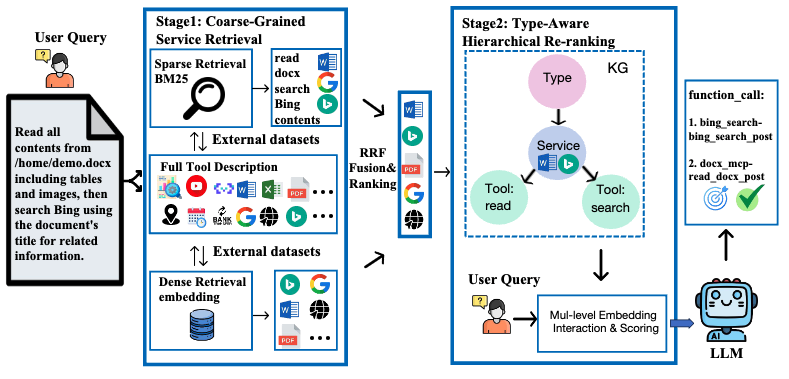
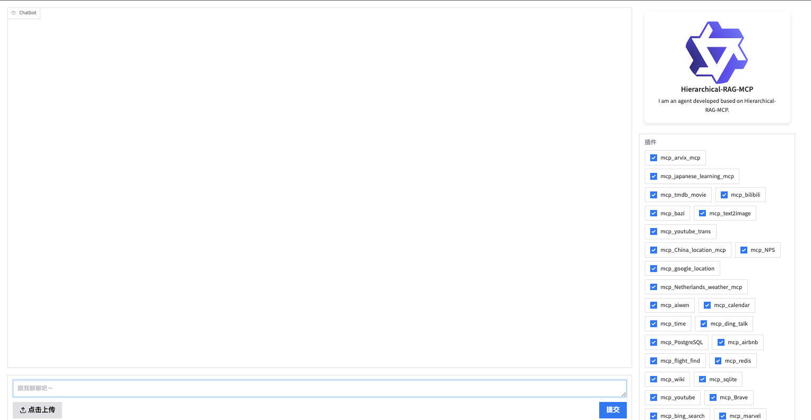

# Hi-RAG: A Hierarchical Retrieval-Augmented Generation Framework for Scalable and Generalizable Tool Selection in LLM Agents

<div align="center">


<em>Official implementation of <strong>"Hi-RAG: A Hierarchical Retrieval-Augmented Generation Framework for Scalable and Generalizable Tool Selection in Large Language Model Agents"</strong></em>
</div>

<div align="center">

</div>

---

## 📖 Introduction

As tool repositories for LLM agents grow from dozens to thousands of endpoints, flat retrieval paradigms that treat the repository as an unstructured list suffer from **context overload**, **cross-domain semantic collision**, and **degraded selection accuracy**.

**Hi-RAG** addresses this by exploiting the `Type → Service → Tool` hierarchy of the **Model Context Protocol (MCP)** with a principled coarse-to-fine pipeline:

- **Stage 1 — Candidate Service Retrieval.** A *Tool-as-Proxy* hybrid retrieval strategy: BM25 sparse retrieval is combined with dense bi-encoder search via **Weighted Reciprocal Rank Fusion (W-RRF)** to rapidly identify candidate services.
- **Stage 2 — Type-Aware Hierarchical Re-ranking.** A local heterogeneous graph integrates a **domain-level gate** (`β_s`), a **type-augmented contextualized tool attention** (`α_i`), and **hierarchical aggregation** for precise service scoring.

The framework provides **`O(1)` context growth** with respect to repository size and a formal **hierarchical entropy reduction** guarantee — explaining the empirical accuracy and token-efficiency gains.

### Key Features

- **Structure-Aware Retrieval** — leverages the MCP `Type → Service → Tool` hierarchy throughout the pipeline.
- **Two-Stage Coarse-to-Fine Architecture** — non-parametric hybrid retrieval followed by a graph-based type-aware reranker (~5.6M trainable params).
- **MCPBench** — a new benchmark of **201 tools across 40 real-enterprise services** (8 functional types) with **261 queries** (201 single-service + 60 multi-service).
- **Strong Baselines Included** — Full-Service injection, Flat-RAG (BM25 + dense + W-RRF), and **ColBERT-RAG** (token-level MaxSim late-interaction), matching Table 2 of the paper.
- **Zero-Shot Generalization** — evaluated on **ToolLLM (16,464 tools)** without re-training; consistent NDCG gains across Q1/Q2/Q3.

### Repository Contents

1. **Hi-RAG Framework** — source code for the two-stage retrieval and re-ranking pipeline.
2. **MCPBench** — benchmark assets: **8 types, 40 services, 201 tools, 261 queries**.
3. **ToolBench Integration** — evaluation pipeline for the large-scale ToolLLM dataset.
4. **Baselines** — Full-Service, Flat-RAG, and ColBERT-RAG implementations sharing a single harness.

---

## 📊 Main Results (MCPBench)

Comprehensive comparison on MCPBench across five LLMs (Table 2 of the paper). `∆Acc` is the improvement over the *strongest* competing baseline (Flat-RAG or ColBERT-RAG, whichever is better).

| Model            | Method        | Single-Turn Top-1 (%) ↑ | AvgTokens ↓ | Multi-Turn Top-3 (%) ↑ | AvgTokens ↓ |
| ---------------- | ------------- | -----------------------:| -----------:| ----------------------:| -----------:|
| **Qwen3-8B**     | Full Service  | 38.8                    | 423.5       | 11.7                   | 739.0       |
|                  | Flat-RAG      | 72.6                    | 170.8       | 36.7                   | 288.7       |
|                  | ColBERT-RAG   | 73.1                    | 168.4       | 37.5                   | 281.2       |
|                  | **Hi-RAG**    | **78.1 (+5.0)**         | **130.5**   | **43.3 (+5.8)**        | **198.6**   |
| **Qwen3-32B**    | Full Service  | 47.8                    | 610.0       | 21.7                   | 1306.4      |
|                  | Flat-RAG      | 75.6                    | 82.7        | 38.3                   | 134.4       |
|                  | ColBERT-RAG   | 76.6                    | 81.5        | 40.0                   | 132.7       |
|                  | **Hi-RAG**    | **82.6 (+6.0)**         | **67.4**    | **48.3 (+8.3)**        | **92.9**    |
| **QwQ-32B**      | Full Service  | 45.3                    | 597.5       | 20.0                   | 1416.3      |
|                  | Flat-RAG      | 75.6                    | 482.8       | 28.3                   | 1353.3      |
|                  | ColBERT-RAG   | 76.1                    | 478.5       | 30.0                   | 1340.7      |
|                  | **Hi-RAG**    | **82.6 (+6.5)**         | **377.4**   | **36.7 (+6.7)**        | **973.6**   |
| **DeepSeek-V3**  | Full Service  | 41.3                    | 167.2       | 6.7                    | 271.2       |
|                  | Flat-RAG      | 75.1                    | 111.3       | 33.3                   | 236.6       |
|                  | ColBERT-RAG   | 76.1                    | 109.7       | 34.2                   | 232.9       |
|                  | **Hi-RAG**    | **82.6 (+6.5)**         | **79.4**    | **40.0 (+5.8)**        | **169.3**   |
| **GPT-4o-mini**  | Full Service  | 40.3                    | 108.6       | 6.7                    | 199.6       |
|                  | Flat-RAG      | 77.1                    | 77.3        | 28.3                   | 159.2       |
|                  | ColBERT-RAG   | 77.6                    | 75.8        | 28.3                   | 156.8       |
|                  | **Hi-RAG**    | **83.1 (+5.5)**         | **59.4**    | **31.7 (+3.4)**        | **116.6**   |

**Highlights**: Hi-RAG improves Top-1 accuracy by up to **+7.5% over Flat-RAG** (single-service) and **+10.0%** (multi-service), and **+5.0–+6.5% over ColBERT-RAG**, while reducing token consumption by up to **89%** vs. Full-Context injection.

### Zero-Shot Generalization on ToolLLM (16,464 tools)

| Subset | Method   | NDCG@1                | NDCG@3                | NDCG@5                |
| ------ | -------- | ---------------------:| ---------------------:| ---------------------:|
| Q1     | Flat-RAG | 64.79                 | 67.05                 | 69.12                 |
|        | Hi-RAG   | **69.21 (↑4.42)**     | **71.91 (↑4.86)**     | **73.36 (↑4.24)**     |
| Q2     | Flat-RAG | 52.36                 | 54.17                 | 56.02                 |
|        | Hi-RAG   | **57.59 (↑5.23)**     | **60.81 (↑6.64)**     | **62.16 (↑6.14)**     |
| Q3     | Flat-RAG | 56.23                 | 58.79                 | 60.72                 |
|        | Hi-RAG   | **61.35 (↑5.12)**     | **64.23 (↑5.44)**     | **67.04 (↑6.32)**     |

---

## ⚙️ Environment Setup

### 1. Installation

We recommend Conda for environment management.

```bash
conda create -n rag_py312 -y python=3.12
conda activate rag_py312

pip install -r requirements.txt
```

### 2. LLM Backend Serving (vLLM)

Hi-RAG requires an LLM backend for tool-invocation inference and an embedding backend for Stage-1 retrieval. We use [vLLM](https://github.com/vllm-project/vllm) for high-performance serving.

> **Note:** Adjust `--gpu-memory-utilization` based on your hardware.

```bash
# 1. Generator LLM (example: Qwen3-32B on port 38084)
nohup vllm serve Qwen3-32B \
    --port 38084 \
    --gpu-memory-utilization 0.9 \
    --max-model-len 32768 \
    --seed 0 > qwen3_32b.log 2>&1 &

# 2. Embedding model used by Stage 1 (BGE-Large) and by ColBERT-RAG
vllm serve BAAI/bge-large-en-v1.5 --task embed --port 8083
```

Update endpoints in [`config.py`](config.py) to point to your servers (`LLMConfig.LLM_SET_*` and `RemoteConfig.embedding_config`).

---

## 🗂️ Datasets & Benchmarks

### MCPBench (Hierarchical MCP Benchmark)

**MCPBench** is constructed from a real-enterprise office-automation platform. It is the first benchmark explicitly designed for **hierarchical tool selection at scale** and avoids the functional redundancy present in public registries (e.g., 18 PDF services / 11 Excel services / 29 search services).

| Component                          | Count        |
| ---------------------------------- | -----------: |
| Tool Types (Functional Categories) | 8            |
| Services                           | 40           |
| Tools (Endpoints)                  | 201          |
| Avg. Tools per Service             | 5.0          |
| Max. Tools in a Single Service     | 62           |
| Total User Queries                 | 261          |
| Single-Service Queries             | 201 (77.0%)  |
| Multi-Service Queries              | 60  (23.0%)  |
|   ↳ Two-service queries            | 40  (15.3%)  |
|   ↳ Three-or-more service queries  | 20  ( 7.7%)  |

#### Data Organization

- **Service Schemas** (`app/mcp_service/`): definitions for **8 functional types**, **40 services**, **201 tools**.
- **Evaluation Queries** (`data/query_test/`):
  - `sig_mcp_test.json` — **Single-Service** queries (precision-focused).
  - `mul_mcp_test.json` — **Multi-Service** queries (cross-domain reasoning).

#### High-Fidelity Service Stubs

To ensure **scientific reproducibility** and **deterministic evaluation**, services in this repository are implemented as *high-fidelity stubs*:

- **Semantic layer.** Original Pydantic models, function signatures, and docstrings from real MCP registries (YouTube, GitHub, Slack, …) are preserved verbatim, retaining the full complexity of the selection task.
- **Execution layer.** Backend execution is simulated, isolating **tool selection capability** from confounders such as network latency, rate limits, or authentication.

### ToolBench (REST API-Based Evaluation)

We additionally evaluate Hi-RAG on the widely-used **ToolBench / ToolLLM** dataset (16,464 tools) — *zero-shot*, with no re-training.

#### Data Preparation

1. Download from the official Google Drive:
   `https://drive.google.com/drive/folders/1TysbSWYpP8EioFu9xPJtpbJZMLLmwAmL`
2. Place the following files into `data/tool_bench/`:
   - `tool_bench_summary.json` — hierarchical tool structure (Type → Service → Tool).
   - `G1_query.json` — G1 test queries (In-Category).
   - `G2_query.json` — G2 test queries (In-Category).
   - `G3_query.json` — G3 test queries (Out-of-Category).

```text
data/
└── tool_bench/
    ├── tool_bench_summary.json
    ├── G1_query.json
    ├── G2_query.json
    └── G3_query.json
```

---

## 🚀 Usage & Evaluation

### Evaluation on MCPBench

#### Step 1 — Initialize the MCP Ecosystem

Launch the simulated MCP server environment (all 40 service instances):

```bash
cd scripts
bash service_start.sh
```

#### Step 2 — Run Evaluation

The following scripts share a single harness (`signal_infer` / `mul_infer`) that dispatches by `rag_type ∈ {None, FlatRAG, COLBERT, HIRAG}`.

**Option A — Single-Service Evaluation (Top-1)**

Precision-focused evaluation of selecting the single correct tool.

```bash
bash sig_hi_test.sh        # Hi-RAG (Ours)
```

**Option B — Multi-Service Evaluation (Top-3)**

Cross-domain reasoning over multiple services and tools.

```bash
bash mul_hi_test.sh        # Hi-RAG (Ours)
```

**Option C — ColBERT-RAG Baseline**

Reproduces the ColBERT-RAG row of Table 2 — flat late-interaction retrieval where the standard bi-encoder cosine is replaced with the token-level MaxSim score:

```
S(q, d) = Σ_{i ∈ |q|}  max_{j ∈ |d|}  ⟨ E_q[i] , E_d[j] ⟩
```

The tool corpus is encoded once with `BAAI/bge-large-en-v1.5` and cached under `data/colbert_save/`; subsequent runs reuse the cache.

```bash
# Single-service (Top-1)
bash sig_colbert_test.sh

# Multi-service (Top-3)
bash mul_colbert_test.sh
```

**Option D — Flat-RAG / Full-Service Baselines**

The `signal_infer` and `mul_infer` entry points also accept `rag_type='FlatRAG'` and `rag_type=None` (Full-Service injection); see [`run_sig_HI_rag.py`](run_sig_HI_rag.py) for the dispatch pattern.

#### Step 3 — Cleanup

Terminate all background service processes:

```bash
bash service_stop.sh
```

### Evaluation on ToolBench

Hi-RAG provides a unified evaluation pipeline with automatic NDCG@k computation.

```bash
cd scripts
bash ToolBench.sh

# Or run specific test sets / baselines directly:
python ../tool_bench_hi_rag.py 1            # Hi-RAG on G1 (default)
python ../tool_bench_hi_rag.py 2 colbert    # ColBERT-RAG on G2
python ../tool_bench_hi_rag.py 3 hi_rag     # Hi-RAG on G3 (explicit)
```

The second positional argument selects the retrieval method (`hi_rag` or `colbert`); results are written to `evaluation_results_G{1,2,3}_{hi_rag,colbert}.json`.

### Web Demonstration (Optional)

```bash
bash web.sh
```

---

## 🧩 Method at a Glance

Hi-RAG implements Algorithm 1 of the paper:

```
Stage 1 — Candidate Service Retrieval
    R_sp   ← BM25(q, T)                       # sparse ranked list
    R_de   ← BiEncoder(q, T)                  # dense ranked list   (bge-large-en)
    R_fus  ← W-RRF(R_sp, R_de, α, k=60)       # Eq. 5
    S_cand ← { ψ(t)  |  t ∈ Top-M(R_fus) }    # Tool-as-Proxy mapping

Stage 2 — Type-Aware Hierarchical Re-ranking      ( per s ∈ S_cand )
    τ_s    ← φ(s)
    β_s    ← σ( MLP_gate( [h_q ‖ h_τ ‖ h_q ⊙ h_τ] ) )      # Eq. 6 (domain gate)
    {e_i}  ← TypeAugAttn(q, τ_s, {t_i ∈ T_s})              # Eq. 7
    {α_i}  ← softmax({e_i})
    h_s'   ← LN( h_s + Σ_i α_i · W_v h_{t_i} + γ · (h_s ⊙ h_τ) )   # Eqs. 8–9
    Score(q, s) ← β_s · MLP_score( h_s' ⊙ h_q )            # Eq. 10

S_topK ← TopK(S_cand, Score)
P      ← ConstructPrompt(q, S_topK)         # hierarchical context
return LLM(P)
```

**Implementation map**

| Component                                  | File                                                                 |
| ------------------------------------------ | -------------------------------------------------------------------- |
| Stage 1: BM25 + Dense + W-RRF              | [`app/rag/search.py`](app/rag/search.py), [`app/rag/keyword_search.py`](app/rag/keyword_search.py), [`app/rag/vector_search.py`](app/rag/vector_search.py) |
| Stage 2: Domain Gate `β_s`                 | `DomainLevelGating` in [`app/sig_mcp/sigmcp.py`](app/sig_mcp/sigmcp.py) / [`app/mul_mcp/mulmcp.py`](app/mul_mcp/mulmcp.py) |
| Stage 2: Type-Augmented Attention `α_i`    | `TypeAugmentedToolAttention`                                          |
| Stage 2: Hierarchical Aggregation `h_s'`   | `HierarchicalAggregator`                                              |
| Stage 2: Reranker wrapper                  | `TypeAwareHierarchicalReranker`, `HiRAGRerankerWrapper`              |
| Baseline: ColBERT-RAG (MaxSim)             | [`app/rag/colbert_search.py`](app/rag/colbert_search.py), [`app/rag/colbert_rag.py`](app/rag/colbert_rag.py) |

---

## 📂 Directory Structure

```text
Hierarchical-RAG-MCP/
├── app/
│   ├── mcp_service/                # 8 categories, 40 services, 201 tools
│   │   ├── browser-automation/
│   │   ├── calendar-management/
│   │   ├── entertainment-and-media/
│   │   ├── file_systems/
│   │   ├── finance/
│   │   ├── location_weather_find/
│   │   ├── research/
│   │   └── search/
│   ├── rag/                        # Stage 1 retrieval + ColBERT baseline
│   │   ├── embedding/
│   │   ├── keyword_search.py       # BM25
│   │   ├── vector_search.py        # Dense retrieval
│   │   ├── search.py               # W-RRF fusion
│   │   ├── model.py                # SimpleRagQA wrapper
│   │   ├── write.py                # Index construction
│   │   ├── colbert_search.py       # Token-level MaxSim retriever
│   │   └── colbert_rag.py          # ColBERTRagQA wrapper
│   ├── sig_mcp/sigmcp.py           # Single-service eval (Full / Flat / ColBERT / Hi-RAG)
│   └── mul_mcp/mulmcp.py           # Multi-service eval  (Full / Flat / ColBERT / Hi-RAG)
├── data/
│   ├── query_test/                 # MCPBench evaluation queries
│   │   ├── sig_mcp_test.json
│   │   └── mul_mcp_test.json
│   ├── service_info/               # summary2other.json, info.txt
│   └── tool_bench/                 # ToolBench / ToolLLM data (user-provided)
├── paper/                          # Paper PDF
├── scripts/
│   ├── service_start.sh            # Launch MCP ecosystem (40 services)
│   ├── service_stop.sh             # Terminate MCP ecosystem
│   ├── sig_hi_test.sh              # Single-service Hi-RAG
│   ├── mul_hi_test.sh              # Multi-service  Hi-RAG
│   ├── sig_colbert_test.sh         # Single-service ColBERT-RAG
│   ├── mul_colbert_test.sh         # Multi-service  ColBERT-RAG
│   ├── ToolBench.sh                # ToolBench evaluation
│   └── web.sh                      # Web demo
├── run_sig_HI_rag.py               # Hi-RAG single-service runner
├── run_mul_HI_rag.py               # Hi-RAG multi-service  runner
├── run_sig_COLBERT_rag.py          # ColBERT-RAG single-service runner
├── run_mul_COLBERT_rag.py          # ColBERT-RAG multi-service  runner
├── tool_bench_hi_rag.py            # ToolBench retrieval + NDCG evaluation
├── service.py                      # Service lifecycle helpers
├── show.py                         # Web demo entry
├── config.py                       # Endpoints / paths / hyperparameters
├── requirements.txt
└── README.md
```

---


